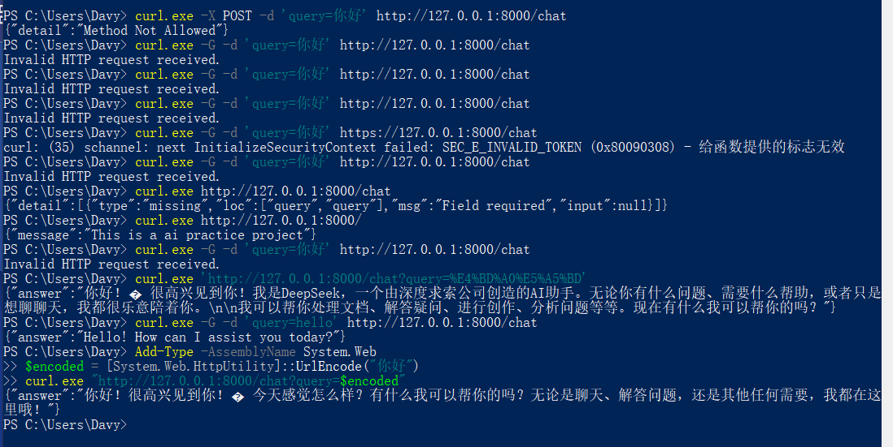

# 概述
这是一个ai接口调用的联系工程

# 虚拟环境
<!-- 发现用docker部署非常有必要，因为环境不同，启动的方式也不同，神奇 -->
假设你是windows系统，并且已安装python环境
创建虚拟环境：
```
python3 -m venv .venv
```
启动虚拟环境
```
.venv\Scripts\activate
```
# 依赖
本项目依赖openai、fastapi、uvicorn、os、dotenv等模块

```
pip install fastapi uvicorn[standard] openai

```
# 项目配置
需 .env 文件，放在项目目录中
包含
```
API_KEY=sk-XXXXXXXXXXXXXXXXXXX
BASE_URL=https://api.deepseek.com
MODEL=deepseek-v4-pro
```

# 项目启动


启动应用
```
uvicorn main:app --reload
```

# 项目入口

可通过http://127.0.0.1:8000/docs 访问文档

# ai聊天接口


可通过http://127.0.0.1:8000/chat 访问

curl 命令：在powershell中执行
```
curl.exe -G -d 'query=hello' http://127.0.0.1:8000/chat
<!-- curl -G -d "query=你好" http://127.0.0.1:8000/chat 中文会报错需要先转码，是windows PowerShell 用 GBK 编码中文给curl，到了服务器端，按 UTF-8 解码，报错后返回给前端的
可以用 
curl.exe 'http://127.0.0.1:8000/chat?query=%E4%BD%A0%E5%A5%BD'
或者用
Add-Type -AssemblyName System.Web
$encoded = [System.Web.HttpUtility]::UrlEncode("你好")
curl.exe "http://127.0.0.1:8000/chat?query=$encoded"
 -->

```


# 异常处理

错误代码

5XX:服务器异常，包括系统内部异常

# todo

服务器后台在爆warning
```
WARNING:  Invalid HTTP request received.
```
这个异常应该要包起来